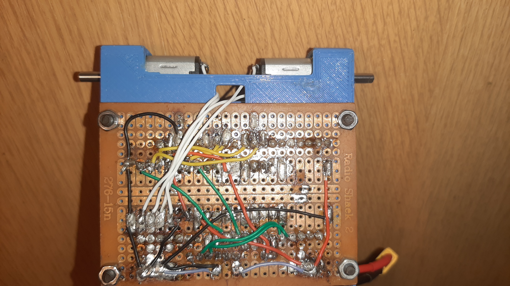

#  Instructable: Bouw van de Line Follower Robot

Dit document is een stappenplan (Instructable) dat beschrijft hoe de Line Follower Robot gebouwd moet worden, uitgaande van de *Bill of Materials* en de *Technische Tekeningen* (met name *SchemaPlanB*). De bijgevoegde afbeeldingen dienen als visuele referentie tijdens de montage.

---

##  Deel 1: Voorbereiding en Componenten (Stap 1-3)

### Stap 1: Componenten Bestellen en 3D-printen
* Bestel alle elektronische componenten uit de *Bill of Materials*.
* 3D-print de mechanische componenten die beschreven staan in de map `/technishe tekeningen/mechanish`.

### Stap 2: Pinnen op Breakout Boards Solderen
* Soldeer de *header pins* aan alle componenten (ESP-32, Motor Driver, Buck Converter, en de 8-channel Line Follow sensor).
    > **Opmerking:** Er is gekozen voor breakoutboards om het solderen te vereenvoudigen en componenten gemakkelijk te kunnen vervangen.

### Stap 3: Voorbereiden van de Perforatieprint (Prototyping Board)
Dit is de basis van de bedrading.

1.  Soldeer de **vrouwelijke header pinnen** aan het perforatieprintje. Zorg voor voldoende ruimte tussen de pinnen en het 3D-geprinte frame (zie afbeeldingen).
2.  **Voeding:** Soldeer de **male extender cord** (voor de batterijvoeding) aan de printplaat. Boor gaten in de printplaat zodat de uiteinden de + en - pads kunnen raken.
3.  **Condensator:** Soldeer een **condensator van 1000 $\mu$F** in parallel over de batterijspanning. Deze zal spanningspieken opvangen.
4.  **Motoren:** Soldeer 2 kleine condensatoren over de motoren zelf (dit is optioneel, maar aanbevolen om spanningspieken te vermijden).
5.  Soldeer draden aan de motoren om ze via het voorziene 'poortje' naar het printplaatje te leiden en aan te sluiten. 
6.  **Interne Bedrading:** Maak de juiste verbindingen (korte draadbruggen) tussen de toekomstige componenten (**ESP-32**, **Motor Driver**, **Buck Converter**) op de onderkant van het perforatieprintje. Volg hiervoor nauwkeurig het schema in *technishe tekeningen / schemaPlanB*.

   
    

---

##  Deel 2: Montage en Installatie (Stap 4-6)

### Stap 4: Montage van het Frame en de Printplaat
* Plaats het **perforatieprintje (met de motoren)** onder het 3D-geprinte frame.
* Lijn de gaten uit.
* Schroef het geheel aan elkaar met de 4 conische bouten en moeren.
    

### Stap 5: Plaatsen van de Hoofdcomponenten
* Plaats de **extender female pinnen** op de reeds gesoldeerde female pinnen van het perforatieprintje.
* Plaats de **ESP-32** op de extender pinnen. Zorg dat de ESP correct is georiënteerd.
* Plaats de **Motor Driver** (rood) en de **Buck Converter** (blauw) op de daarvoor bestemde plekken op de printplaat.
    

### Stap 6: Montage van de Line Follower Sensor
* Plaats de **8-channel Line Follow sensor** in de voorziene opening aan de voorkant van het frame.
* Schroef deze vast met de bijbehorende bouten en moeren.
    

---

##  Deel 3: Finale Aansluitingen en Afwerking (Stap 7-8)

### Stap 7: Aansluiten van de Motoren en Sensoren
1.  **Motoraansluiting:** Sluit de draden van de motoren aan op de Motor Driver volgens het schema.
2.  **Sensor Aansluiting:** Neem **Dupont draadjes** en steek die in de overgebleven open female headers (die verbonden zijn met de ESP-pinnen).
3.  Maak de verbinding tussen deze headers en de pinnen van de **8-channel Line Follow sensor** volgens het schema.

### Stap 8: Finaliseren en Klaar voor Software
* Bevestig de wielen op de motorassen.
* Sluit de batterij aan op de XT60-connector.
* De robot is nu mechanisch en elektrisch geassembleerd.

    

---

##  Deel 4: Microcontroller Programmering

1.  Volg de instructies in de technische documentatie om de code voor de **microcontroller (ESP-32)** te compileren.
2.  Upload de gecompileerde code naar de ESP-32 om de robot functioneel te maken.
