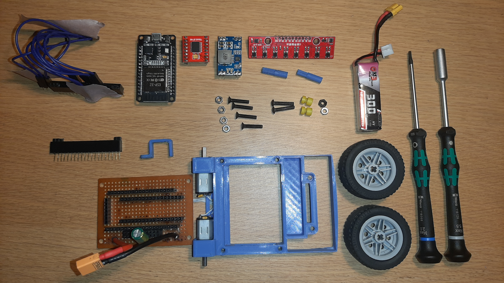
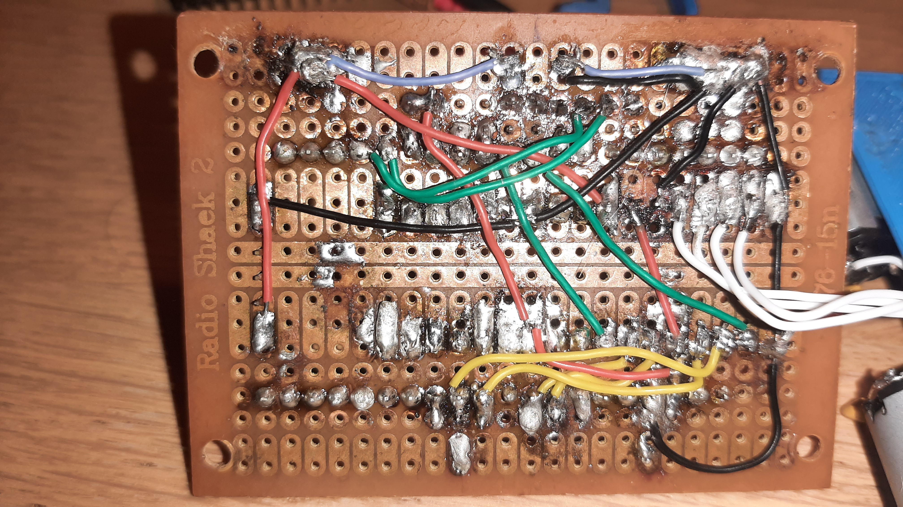
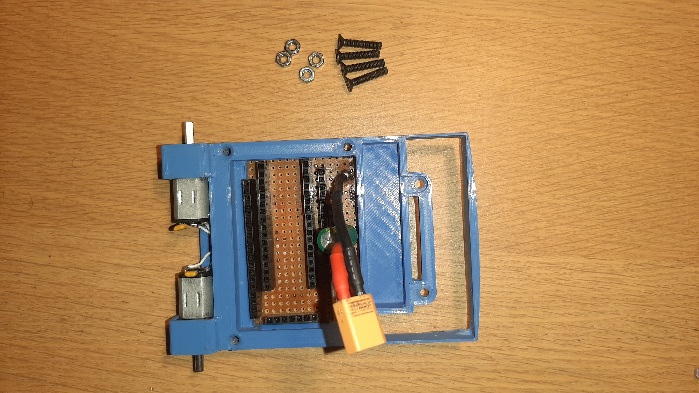
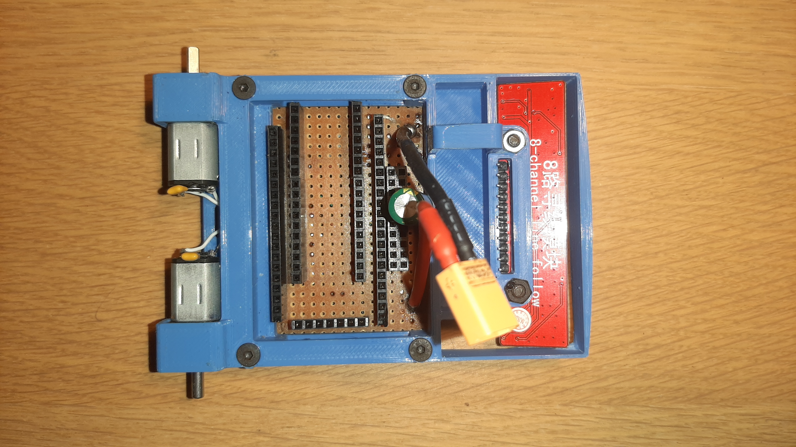
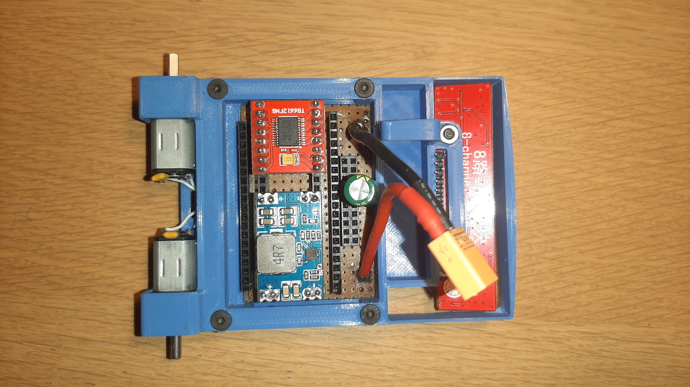
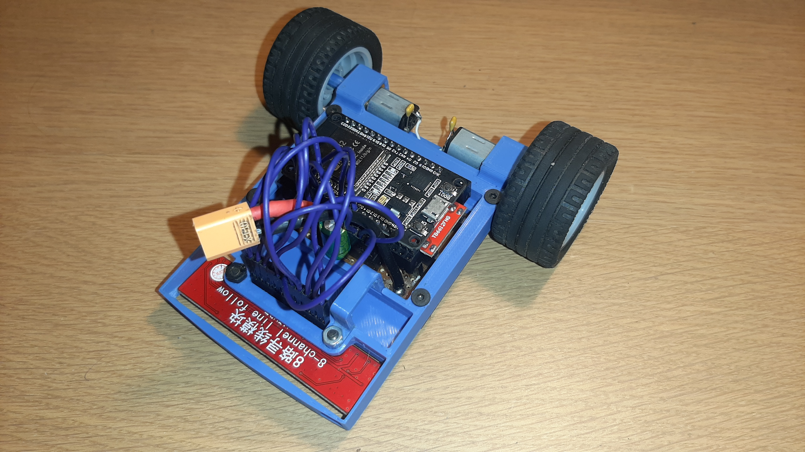

#  Instructable: Bouw van de Line Follower Robot

Dit document is een stappenplan dat beschrijft hoe de Line Follower Robot gebouwd moet worden, uitgaande van de *Bill of Materials* en de *Technische Tekeningen* (met name *PlanB*). De bijgevoegde afbeeldingen dienen als visuele referentie tijdens de montage.

(niet alle stappen hebben een afbeelding, wanneer het niet duidelijk is kan je altijd eens kijken of er geen duidelijkere afbeelding in /instructable staan)

---

##  Deel 1: Voorbereiding en Componenten 

### Stap 1: Componenten Bestellen en 3D-printen
* Bestel alle elektronische componenten uit de *Bill of Materials*.
* 3D-print de mechanische componenten die beschreven staan in de map `/technishe tekeningen/mechanish`.
  
  
### Stap 2: Pinnen op Breakout Boards Solderen
* Soldeer de *header pins* aan alle componenten (ESP-32, Motor Driver, Buck Converter, en de 8-channel Line Follow sensor).
    > **Opmerking:** Er is gekozen voor breakoutboards om het solderen te vereenvoudigen en componenten gemakkelijk te kunnen vervangen.

### Stap 3: Voorbereiden van de Perforatieprint (Prototyping Board)
Dit is de basis van de bedrading.

1.  Soldeer de **vrouwelijke header pinnen** aan het perforatieprintje. Zorg voor voldoende ruimte tussen de pinnen en het 3D-geprinte frame (zie afbeeldingen).
2.  **Voeding:** Soldeer de **male extender cord** (voor de batterijvoeding) aan de printplaat. Boor gaten in de printplaat zodat de uiteinden de + en - pads kunnen raken.
3.  **Condensator:** Soldeer een **condensator van 1000 µF** in parallel over de batterijspanning. Deze zal spanningspieken opvangen.
4.  **Motoren:** Soldeer 2 kleine condensatoren over de motoren zelf (dit is optioneel, maar aanbevolen om spanningspieken te vermijden).
5.  Soldeer draden aan de motoren om ze via het voorziene 'poortje' naar het printplaatje te leiden en aan te sluiten. 
6.  **Interne Bedrading:** Maak de juiste verbindingen (korte draadbruggen) tussen de toekomstige componenten (**ESP-32**, **Motor Driver**, **Buck Converter**) op de onderkant van het perforatieprintje. Volg hiervoor nauwkeurig het schema in *technishe tekeningen / schemaPlanB*.

   

---

##  Deel 2: Montage en Installatie

### Stap 4: Montage van het Frame en de Printplaat
* Plaats het **perforatieprintje (met de motoren)** onder het 3D-geprinte frame.
* Lijn de gaten uit.
* Schroef het geheel aan elkaar met de 4 conische bouten en moeren.
    
  
  
### Stap 5: Montage van de Line Follower Sensor
* Plaats de **8-channel Line Follow sensor** in de voorziene opening aan de voorkant van het frame.
* plaats de batterijhouder juist 
* Schroef deze vast met de bijbehorende bouten en moeren.

    
   
### Stap 6: Plaatsen van de Hoofdcomponenten
* Plaats de **extender female pinnen** op de reeds gesoldeerde female pinnen van het perforatieprintje.
* Plaats de **ESP-32** op de extender pinnen. Zorg dat de ESP correct is georiënteerd.
* Plaats de **Motor Driver** (rood) en de **Buck Converter** (blauw) op de daarvoor bestemde plekken op de printplaat.
    
   
  

---

##  Deel 3: Finale Aansluitingen en Afwerking 

### Stap 7: Aansluiten van de Sensoren
1.  **Sensor Aansluiting:** Neem **Dupont draadjes** en steek die in de overgebleven open female headers (die verbonden zijn met de ESP-pinnen).
2.  Maak de verbinding tussen deze headers en de pinnen van de **8-channel Line Follow sensor** volgens het schema.
   
### Stap 8: verlengde headers monteren en ESP32 monteren 
* plaats de verlengde headers op de andere headers
* monteer daarop de ESP32

### Stap 9: Finaliseren en Klaar voor Software
* Bevestig de wielen op de motorassen.
* Sluit de batterij aan op de XT30-connector.
* De robot is nu mechanisch en elektrisch geassembleerd.

   

---

## Deel 4: Microcontroller Programmeren en Software 

Dit deel beschrijft de stappen om de software op de ESP-32 microcontroller te krijgen en hoe u de robot veilig in gebruik neemt.

### Stap 10: Voorbereiding en Installatie van de Code

1.  **Software-omgeving:** Zorg ervoor dat de **Arduino IDE** (of een vergelijkbare omgeving zoals PlatformIO) correct is geïnstalleerd op uw computer en dat de **Board Support Package voor de ESP-32** is toegevoegd.
2.  **Code Downloaden:** Navigeer naar de map `/code/finaal/` in de projectbestanden.
3.  **Bestanden Bundelen:** Download alle bestanden uit deze map (dit zijn het hoofdprogramma (`.ino`), de implementatiebestanden (`.cpp`), en de headerbestanden (`.h`)).
4.  **Projectmap:** Plaats **alle gedownloade bestanden** in een **enkele nieuwe map** op uw computer. De naam van deze map moet exact overeenkomen met de naam van het `.ino` bestand.
5.  **Openen:** Open de map in de Arduino IDE. De IDE zal nu het volledige project met alle codebibliotheken en klassen herkennen.

### Stap 11: Compilatie en Uploaden naar de ESP-32

1.  **Board Selecteren:** Selecteer in de Arduino IDE de juiste ESP-32 ontwikkelingskaart (meestal **ESP32 Dev Module** of vergelijkbaar, afhankelijk van uw specifieke chip) onder het menu *Tools -> Board*.
2.  **Poort Selecteren:** Selecteer de seriële poort waaraan de ESP-32 is verbonden.
3.  klikt u op de knop **Uploaden** om de code over te brengen naar de ESP-32.

### Stap 12: Belangrijke Veiligheidswaarschuwingen

Lees deze waarschuwingen zorgvuldig door om schade aan de elektronica te voorkomen:

* **Batterij en USB Nooit Samen:** **Steek NOOIT de batterij en de USB-kabel tegelijkertijd in.** Dit kan leiden tot een stroomconflict, overmatige hitte, en permanente schade aan de ESP-32 en/of de batterij.
* **Motoren Testen via USB:** **Test of voed de motoren NOOIT via de USB-kabel van de ESP-32.** De ESP-32 heeft een interne 3.3V-regulator die niet ontworpen is om de hoge piekstroom te leveren die motoren vereisen. Dit kan leiden tot overbelasting, instabiliteit van de microcontroller, of falen van de regulator. Voed de motoren altijd via de externe batterij en de Motor Driver (gebruik de USB alleen voor programmeren).

### Stap 13: Installatie van de Gebruikersinterface (GUI/APP)

1.  Volg het stappenplan in de map `code/GUI/readme.md` om de bijbehorende gebruikersinterface (GUI/APP) te installeren op computer.
