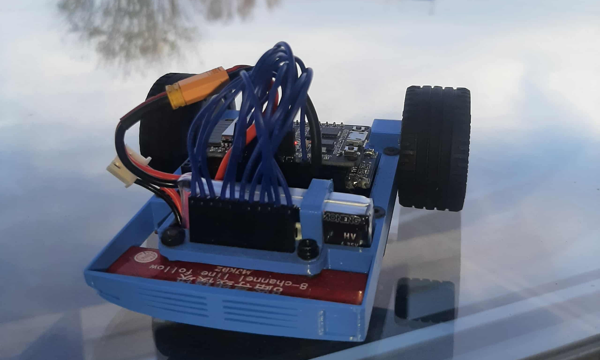

# LineFollower

  
## specifications

microcontroller: ESP32 

motors: Aslong JGA12-N20-10

h-bridge: TB6612FNG 

sensors: 8x IR Lijn Tracking Module

batteries: LIHV 2s 300mAh

wireless communication: Bleutooth

distance sensor - motors: 90mm

weight: 150 Gr

speed: 0.27 m/s

